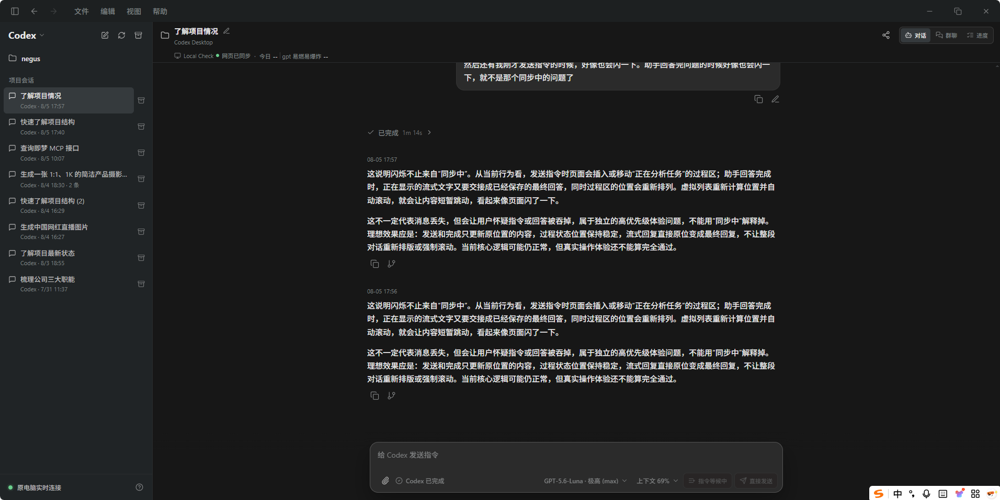
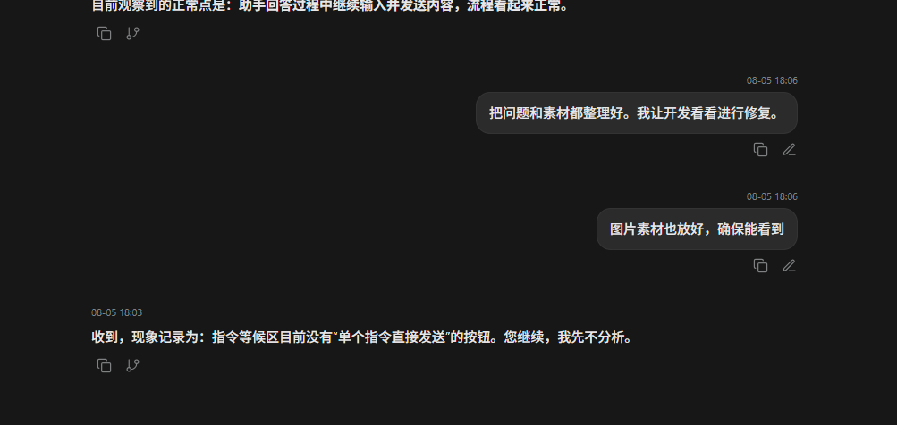
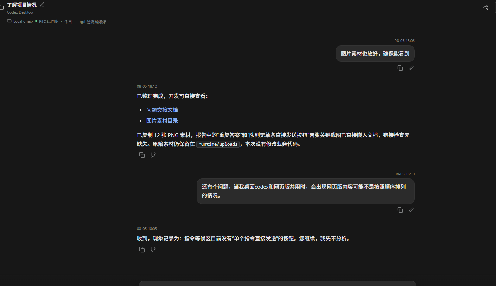
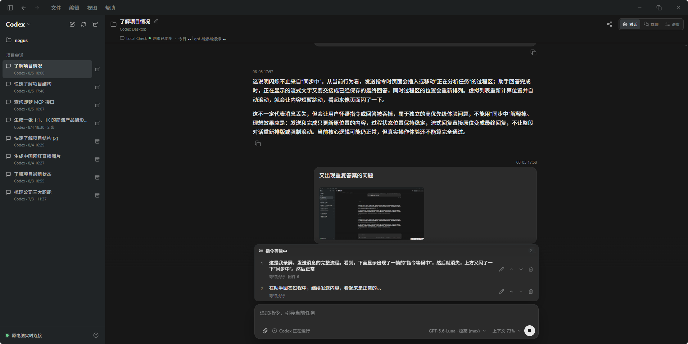

# 网页版 Negus 消息发送流程体验问题清单

更新时间：2026 年 8 月 5 日

## 结论摘要

当前发送流程基本可以完成任务，但仍有一个需要优先处理的用户可见问题：**同一条助手回复可能在页面上重复显示**。此外，发送和同步过程中的短暂状态闪现、队列操作不完整、输入框布局变化，会让用户无法准确判断消息处于什么状态。

本清单只记录用户实际观察到的现象、复现路径和验收要求，不预设具体代码原因。

## 问题清单

### P0：同一条助手回复重复显示

**现象**

- 同一段助手回答在对话中出现两次。
- 两条内容视觉上相同，但时间戳不同，并且各自带有复制等操作按钮。
- 用户已经实际遇到过，不是理论风险。

**用户影响**

- 用户无法判断助手是否执行了两次、回答是否被重复提交。
- 长任务或涉及文件修改时，会直接影响对结果的信任。

**复现关注点**

1. 在已有会话中发送一条消息。
2. 等待助手回答完成，期间观察页面刷新、同步或状态切换。
3. 检查回答完成后、重新打开会话后，是否出现同一逻辑回复两份。
4. 重点覆盖流式回答转最终回答、刷新恢复、断线重连和继续发送消息后的场景。

**验收要求**

- 同一条逻辑助手消息在页面上只能显示一次。
- 流式内容转为最终内容时不能新增一份重复消息。
- 页面刷新、重新打开会话、断线恢复后不能重新插入重复消息。
- 即使消息来源或标识发生变化，也应能识别为同一条逻辑回复。

**素材**

- [重复答案截图](assets/ux-issues-2026-08-05/fa6411570c7bbd5cae8ad7f2b0cd8adfb8f454074aac3631b570141f2249816e__image.png)

### P0：跨端回复未补回且消息顺序错乱（已确认）

**现象**

- 桌面 Codex 和网页版同时使用同一项目或会话时，网页版中的消息没有按照实际逻辑顺序排列。
- 第一张时间线截图中，网页版在 `18:06` 已显示两条由桌面端发送的用户消息，但当时还没有显示对应的桌面端助手回复。
- 第二张截图显示，桌面端回复完成后，网页版仍把 `18:03` 的旧助手回复放在 `18:10` 的新用户消息之后。
- 因此已确认：这不只是桌面端回答过程中的暂时延迟，网页版没有正确补回最新回复，并且把旧回复显示成了当前对话的最后内容。

**用户影响**

- 用户无法准确还原对话过程，不清楚哪条指令先发送、哪条回复对应哪次任务。
- 当一端正在执行长任务、另一端继续发送消息时，容易把不同任务的状态和回答对应错。
- 用户会误以为桌面端任务没有回答，或把旧回复误认为最新结果。
- 顺序错乱与重复答案同时出现时，会进一步降低用户对消息完整性和执行结果的信任。

**复现关注点**

1. 同时打开桌面 Codex 和网页版，并进入同一项目或会话。
2. 在桌面端发送或触发一条消息，在网页版观察内容变化。
3. 在桌面端任务执行期间，从网页版继续发送一条消息，或反向操作。
4. 重点观察流式内容、最终回复、用户新消息和任务状态在网页版中的排列顺序。
5. 等桌面端回答完成后，确认网页版是否补回完整助手回复。
6. 关闭并重新打开网页版，确认恢复后的顺序是否与实际发生顺序一致。

**验收要求**

- 网页版必须按对话的逻辑发生顺序显示消息，而不是简单按到达时间排列。
- 桌面端晚到的事件、最终回复或恢复数据插入时，不能把已有消息挪到错误位置。
- 用户消息、对应的助手回复和任务状态应保持正确关联。
- 桌面端回答进行中，网页版可以暂时显示“回答生成中”或稳定的同步状态，但不能让用户误以为消息已经丢失。
- 桌面端回答完成后，网页版必须补回完整回复；刷新或重新打开后也必须可见。
- 任何旧助手回复都不能出现在时间更晚的新用户消息之后，也不能成为页面最下方的“最新回复”。
- 刷新、断线重连、切换桌面端/网页版后，消息顺序必须保持一致。

**素材**

- [跨端消息时间线截图](assets/ux-issues-2026-08-05/codex-clipboard-e70adc5c-75b3-4edd-8e3f-1fe4be15ad96.png)

- [跨端回复完成后仍显示旧回复的截图](assets/ux-issues-2026-08-05/codex-clipboard-4aaac0f4-0669-41e6-961a-cf1a834974f9.png)

### P1：发送后短暂出现“指令等候中”

**现象**

- 发送消息后，页面下方的“指令等候中”区域会短暂出现，随后消失。
- 用户看到的是一帧或很短时间的状态，无法理解消息到底是已经发送、正在排队，还是进入了异常恢复流程。
- 当前等候区可能同时出现多条指令，但状态和操作含义不够直观。

**用户影响**

- 用户会怀疑消息是否被误加入队列。
- 用户可能重复点击发送，增加重复执行风险。

**验收要求**

- 直接发送和加入队列必须有稳定、清楚的视觉区分。
- 非队列路径不要短暂闪现“指令等候中”。
- 如果消息确实进入队列，队列状态应保持到状态发生明确变化，不应只显示一帧后消失。
- 状态至少应能区分：待执行、已发送、执行中、已完成、失败。

### P1：顶部“同步中”提示闪现过快

**现象**

- 发送消息后，上方会短暂出现“同步中”或“正在同步最新内容”。
- 助手回答完成时也可能出现一次短暂闪动。
- 提示持续时间太短，用户通常只能看到页面闪了一下。

**用户影响**

- 用户不知道页面是在正常刷新，还是出现了消息丢失、重新加载或状态异常。
- “同步中”和“正在处理任务”等状态可能在视觉上叠加，造成误判。

**验收要求**

- 短暂且正常的同步不应打断用户视线或造成明显闪烁。
- 只有同步持续较长时间、恢复中或确实存在异常时，才显示明显提示。
- 提示出现时应稳定可读，并说明当前对话是否仍可继续操作。
- 同步完成后不应造成消息位置跳动或重复渲染。

### P1：队列中没有单条指令的直接发送按钮

**现象**

- 等候区显示多条待处理指令时，单条指令旁没有“直接发送”或“立即执行”按钮。
- 用户无法只选择其中一条立即执行，也无法明确控制队列顺序。

**用户影响**

- 用户只能依赖当前默认队列行为，无法处理临时插入的高优先级指令。
- 当队列中有多条内容时，用户不清楚下一条会执行哪一条。

**验收要求**

- 每条待处理指令都应有明确的单条操作入口，至少包括编辑、删除，以及产品定义的“立即发送/立即执行”。
- 单条直接发送后，其他队列项的顺序和状态应保持可见、可理解。
- 如果产品设计上不允许单条直接执行，需要在界面上明确说明，而不是只隐藏按钮。

**素材**

- [队列区域截图](assets/ux-issues-2026-08-05/424ec5001c3b3a7c235100a9182e6669e28460f8179f1ebc17d93bb2f15cccb3__image.png)

### P2：输入内容后输入框和底部操作区发生跳变

**现象**

- 输入框一旦出现文字，底部控件会发生切换，输入框高度或按钮区域也会变化。
- 任务运行中，空输入状态和有输入状态显示不同操作，视觉上会产生明显变化。

**用户影响**

- 输入过程中界面像是发生了一次状态切换，用户会感觉不稳定。
- 光标、发送按钮和停止按钮的位置变化可能造成误操作。

**验收要求**

- 输入框的主要位置和高度应保持稳定。
- 状态按钮可以变化，但不应导致整个底部区域明显跳动。
- 有文字、无文字、任务运行中、任务完成后的控件布局都应可预测。

### P2：状态文案和操作含义不够明确

**现象**

- “指令等候中”更像一个状态描述，不像用户可以执行的操作。
- “指令已发送，正在连接 Codex”“正在处理任务”“Codex 正在运行”等状态之间的关系不够清楚。

**用户影响**

- 用户难以判断当前是否需要等待、继续输入、重新发送，还是可以取消。
- 发送失败或恢复中的情况下，用户缺少明确的下一步动作。

**验收要求**

- 状态文案应说明“消息在哪里”和“用户现在能做什么”。
- 同一阶段不要同时展示容易混淆的多个状态。
- 失败、超时、恢复中应提供明确且稳定的处理结果。

## 已观察到的正常行为

以下行为目前看起来正常，修复其他问题时应保持不变：

- 助手回答过程中，用户继续输入并发送内容，流程可以继续运行。
- 发送完成后，页面最终能够回到正常对话状态。
- 问题主要集中在状态切换、队列表达和重复渲染，不应据此改变“回答过程中允许继续发送”的产品行为。

## 建议的修复顺序

1. 先修复重复答案和跨桌面端/网页版的消息顺序，优先验证刷新、同步、断线恢复和流式转最终消息。
2. 再修复发送/队列状态表达，确保直接发送不会短暂进入队列视觉状态。
3. 补齐队列单条指令操作，并明确每条指令的当前状态。
4. 最后处理同步提示闪烁和输入框布局跳变。

## 素材目录

原始素材仍保留在 `runtime/uploads`；为便于开发查看，本报告使用的稳定副本位于 `docs/assets/ux-issues-2026-08-05`。本次未发现原始录屏视频文件，现有素材是录屏抽帧 PNG 和问题截图。

录屏抽帧：

- `2a16d3357a25a57c1b3b6520339e78d687601935de07a52f9be97332a6c27889__20260805-175423.mp4_20260805_175454.107.png`
- `a65cd96926542d4eecc13819d00fbfad2f4ef2e09007081c92b178a08bae8204__20260805-175654.mp4_20260805_175724.999.png`
- `a9068b90c8161a0abb9ef165c0dfa0a27c9a18cf4b734ed5c66ae3f99327ec3f__20260805-175654.mp4_20260805_175729.533.png`
- `b64c56a2f0672e716ce70809acae28ccd7af758e99329e870925895902ee3e17__20260805-175654.mp4_20260805_175733.102.png`
- `1de9f4a7da7d2b9e59852b156f422d1b3e50182bd1de2c3eee7af471646eb36c__20260805-175654.mp4_20260805_175736.676.png`
- `3cfb2f3ca43200e4176aae300e227839a09c3eeb628fbc4446c1acfdf0847cc7__20260805-175654.mp4_20260805_175740.886.png`
- `6d93c7f74135f2af8abc82fff6daf49c062944ca2d5f814a05aaa404e10c9e0b__20260805-175654.mp4_20260805_175748.311.png`

其他截图：

- `0613c4c845e6921d1fd31b2ffbd24beda23d52a7af42eda349285d1a8c7fe5c3__image.png`
- `4976ecf70d51a53a2157d721304e121dc5540ebdabe6853bdba64b2614aa71d0__image.png`
- `de2d7f9663f8a19c5d6978117592a123eb23d7c3aaf623566a38cb80cb5cbeae__image.png`
- `fa6411570c7bbd5cae8ad7f2b0cd8adfb8f454074aac3631b570141f2249816e__image.png`
- `424ec5001c3b3a7c235100a9182e6669e28460f8179f1ebc17d93bb2f15cccb3__image.png`

## 用户补充的待研究体验要求

更新时间：2026 年 8 月 5 日

以下内容保留用户原话，暂作为用户体验研究项记录，不代表已经确定最终交互方案。

### 发送模式与等候队列

**对应问题**：用户希望提前设置“助手回答中继续发送消息”的处理方式；设置入口在助手空闲和回答中都可用，默认等候发送；队列中的每条消息可以单独直接发送。

**用户原话**：

> 不准确。只有当助手正在回答问题的状态时，才应该出现这个指令等候中。用户再发送按钮旁边应该能切换，助手回答中，是直接发送还是等候发送。默认是等候发送。等候发送队列，每一条也有单独的直接发送的按钮。这是不是会变得修改很麻烦？很麻烦就先看下一个。

> 不对。助手空闲和回答中，用户都可以设置“助手回答中是直接发送还是等候发送”。

### 加载与失败提示

**对应问题**：用户不希望正常同步显示文字；正常加载只显示加载缓冲图标；只有同步失败或等待过久时，才复用已有的手动刷新失败提示。

**用户原话**：

> 首先，同步就不应该显示。什么叫同步持续较久呢？什么情况会触发同步叫久？限定一个触发条件才行。

> 还是太复杂了。加一个加载的缓冲图标算了，太久没同步再弹出同步失败的提示，就是之前那个手动刷新的提示。好改吗？

### 当前记录状态

- 以上两项均属于用户体验内容，暂时记录，后续继续研究。
- 发送模式与等候队列暂列为中等复杂度。
- 加载缓冲图标与复用手动刷新失败提示暂列为较简单的体验修改。
- 本节不改变现有功能验收结论，也不授权立即修改代码。

### 桌面端与网页端执行状态未统一

**当前确认结果**：

- 网页版显示的“Codex 已就绪”“Codex 正在运行”“Codex 已完成”来自网页版独立 app-server 的执行追踪。
- 桌面 Codex 正在执行任务时，网页版目前不能可靠取得桌面端实时状态，仍可能显示“Codex 已就绪”。
- 桌面任务完成后，对话内容可以通过后续同步补回，但这不等于网页版已经追踪到桌面端执行过程。

**用户影响**：用户可能把“Codex 已就绪”理解为桌面端也处于空闲状态，无法判断桌面任务是否仍在运行。

**讨论结论**：完整统一桌面端与网页端执行状态的改动难度较高，暂缓修改。后续处理时应优先接入真实桌面端状态；在此之前不能把网页版状态描述成所有 Codex 运行端的统一状态。

**用户原话**：

> 你这个显示的 CodeX 已就绪已完成，说的是我们网页版的，还是说能检测到我们桌面版的一个状态？是不是现在还检测不到桌面版的状态？如果桌面端在运行任务的，其实我们这里是没有任何提示的。

> 但这个任务看起来比较难，那就先不改，记录一下我们的讨论，下一个。

### 图片加载与缓存

**对应问题**：文字已经加载完成，但图片晚到，随后图片出现导致页面高度和布局重新变化。问题重点不是占位区域本身，而是图片是否能够及时加载、是否有可复用的缓存。

**当前点检结论**：

- 对话图片当前使用延迟加载，浏览器可能等图片接近可视区域后才开始请求。
- 当前前端缓存的是图片尺寸，不是图片内容或可复用的小预览图；关闭网页后尺寸缓存也会消失。
- 服务端已有浏览器缓存，但目前主要是原图缓存，没有独立的稳定小预览缓存。
- 图片尚未取得尺寸时，当前默认预览比例为 `4:3`，用户希望改为类似 Codex 的 `1:1` 预览占位。

**用户原话**：

> 为什么会图片晚加载，我觉得这才是问题。理论上应该要有类似缓存之类的。有一个很小的占位小图，可能才10*10.同时，可以改成和codex一样，默认展示1：1的预览占位图。主要还是缓存问题。

**待研究方向**：

- 优先确认图片延迟加载和缓存命中情况，不先用占位图掩盖真实加载问题。
- 研究稳定的小预览图或缩略图缓存。
- 图片未完成加载时，默认使用稳定的 `1:1` 预览区域，加载完成后只替换图片内容，不改变消息位置。
- 本项暂作为用户体验研究项记录，未授权立即修改代码。
