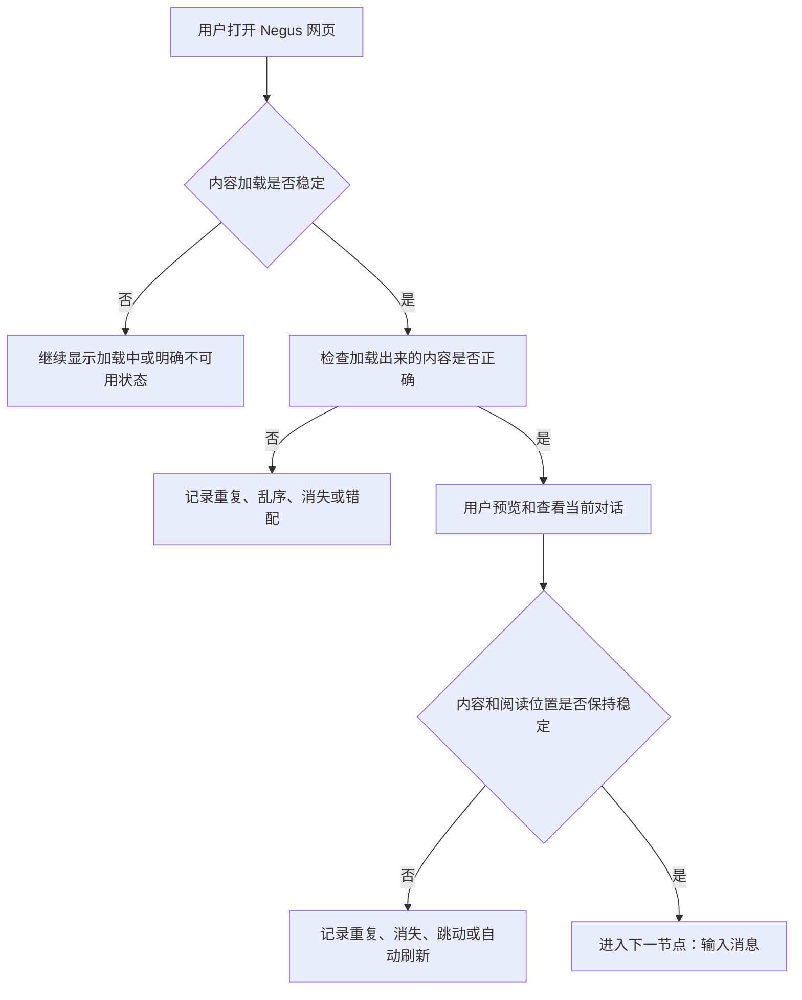

# Negus 网页工作台用户体验测试流程

这是一份从用户视角逐步展开的测试流程。每个节点都可以继续向下衍生新的操作和分支。本版只整理到“预览查看”部分，输入消息暂不展开。

## 当前流程

## UX-001：打开 Negus 网页工作台

### 用户操作

用户打开 Negus 网页地址。

### 加载中，用户应该看到

- 页面明确显示仍在加载。
- 内容可以逐步出现，但页面不会让用户误以为已经加载完成。
- 图片尚未出现时，页面不会因为图片后来加载而大幅跳动。

### 加载完成，用户应该看到

- 用户能明确判断工作台已经可以使用。
- 当前显示的内容完整、稳定。
- 消息没有重复、丢失或突然改变位置。
- 图片已经显示，或者有明确的加载失败状态。
- 加载完成后，页面不会自行重新排列或像刷新一样变化。

### 加载完成后不应该看到

- 同一条消息重复出现。
- 已经出现的消息之后又消失。
- 文字先出现，过一会儿页面整体重新排版。
- 图片突然出现导致用户阅读位置跳动。
- 页面看起来已经能用，但内容还在无提示地变化。
- 空白页面或只有模糊、无法判断含义的错误提示。

### 分支

- `UX-001-A`：正常加载并进入可使用状态。
- `UX-001-B`：加载时间较长，仍能明确知道页面尚未稳定。
- `UX-001-C`：加载失败或出现 502，显示明确不可用状态。
- `UX-001-D`：内容加载异常，出现重复、丢失、跳动或空白。

## UX-002：检查加载内容是否正确

### 前置条件

`UX-001` 中页面已经显示加载完成，并且内容暂时稳定。

### 检查内容

- 当前内容属于用户打开的对话。
- 每条消息只出现一次。
- 消息顺序正确。
- 内容不会在加载后消失、重复或重新排列。
- 图片、附件和文字属于正确的消息，没有错配或遗漏。

### 通过标准

页面加载稳定后，显示的是正确、完整、顺序正常的当前对话内容。

### 失败分支

- `UX-002-A`：内容重复。
- `UX-002-B`：内容乱序。
- `UX-002-C`：内容消失或缺失。
- `UX-002-D`：图片、附件或文字错配。

任务是否仍在运行、长难任务是否合理、是否卡在运行中，作为后续独立测试节点，不在本用例中判断。

## UX-003：预览和查看当前对话

### 用户操作

用户在内容加载完成后，浏览当前对话，并上下滚动查看消息。

### 预期结果

- 当前对话内容连续、完整。
- 滚动过程中没有消息重复、消失或乱序。
- 图片加载完成后，页面不会大幅跳动。
- 用户正在阅读的位置不会被系统突然改变。
- 页面不会因为后台加载而自行刷新。
- 用户能够明确知道自己正在查看哪一个对话。

### 通过标准

用户可以稳定地阅读当前对话，不会因为滚动或媒体加载而改变内容或阅读位置。

### 失败分支

- `UX-003-A`：滚动时消息重复、消失或乱序。
- `UX-003-B`：图片加载造成页面跳动。
- `UX-003-C`：阅读位置被自动改变。
- `UX-003-D`：页面自行刷新或内容重新加载。

## 后续节点

下一节点为“输入消息”。任务运行状态、长难任务、排队发送、直接发送和回复过程在后续节点单独展开。
