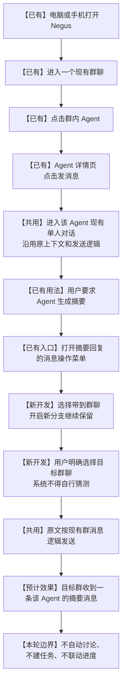

# 项目群聊与多 Agent 协作

## 用户原话

> 初版先做：我发送内容，项目经理回答我、安排其他Agent做，其他Agent做完之后在群里汇报结果。我@谁，谁就回我。没@就是项目经理判断自己回复还是让Agent干活之后回复还是怎么样。我想的是打好地基。

## 助手初步理解

当前目标不是先做多电脑调度，也不是把所有模型同时拉进来聊天，而是在一台电脑上建立一个可靠的 Agent 协作底座：用户只有一个群聊入口；项目经理负责接待、判断、拆解、分派和必要的汇总；用户明确 `@` 某个 Agent 时，该 Agent 直接负责响应；被项目经理安排的其他 Agent 完成后，在群里汇报结果。

模型和运行时需要解耦。Codex、Sol、Luna 等 Agent 角色可以使用 Codex、本地运行时或不同供应商 API 的模型；角色不应被写死为某一个模型。多电脑、远程节点和离线恢复只保留扩展边界，暂不进入初版主链路。Orca 暂不作为当前底座或强依赖。

## 计划评估结论

原开发计划的总体方向合理，与用户目标一致，尤其是“先单机多 Agent、后扩展多电脑”“项目经理统一路由”“模型与角色解耦”“分阶段验收”这几项判断应保留。

但原计划不能直接开工，原因是它把“Agent 能被调用”放得过早，把以下基础问题放得不够靠前：

1. 群聊消息必须有稳定身份、顺序和幂等键，否则用户消息或 Agent 回复可能重复、乱序或刷新后重新出现。
2. 任务不能只存在于内存队列中，否则服务重启后项目经理已经分派的任务会丢失执行状态。
3. 必须明确区分用户消息、项目经理路由决定、Agent 任务、Agent 执行和群内汇报，不能继续用一条回复文本承载全部状态。
4. 项目经理和 Worker 需要使用任务摘要、关联文件、验收标准和已有决策，不应每次把完整群聊复制给所有模型。
5. 停止、失败、重试、审批和部分完成必须有明确状态，否则用户无法判断 Agent 是没有收到任务、正在工作，还是已经失败。
6. 技术测试通过只能证明调用链按设计运行，不能证明用户体验完成；必须以真实群聊场景验收。

因此，本计划调整为：**先建立可靠的消息与任务账本，再做项目经理路由，再接入多 Agent 和多模型，最后完善协作体验与扩展接口。**

## 简短摘要

把已有的群聊原型升级为一个单机多 Agent 项目协作中心。用户始终从一个群聊入口工作，项目经理是默认接待者，`@` 是明确指定入口，专业 Agent 负责执行并公开汇报。所有消息、任务、执行记录、结果和交付物可以互相追溯。

## 产品目标

### 初版必须实现

- 用户直接发消息时，由项目经理统一接收。
- 项目经理可以直接回答，也可以说明任务安排后交给一个或多个专业 Agent。
- 用户 `@` 某个 Agent 时，被点名的 Agent 直接响应或执行任务。
- Agent 完成任务后，在同一个群里汇报结论、产物、风险和待确认事项。
- 用户可以继续追问原消息、原任务或某个 Agent 的结果，不需要重新描述完整背景。
- 用户能够看见任务处于等待、执行中、等待用户、已完成、失败、已停止或待审批中的哪一种状态。
- 同一条用户消息和同一份 Agent 结果不会因为实时事件、乐观显示、刷新或重连而重复出现。
- 服务重启后，已保存的群聊消息和未完成任务能够恢复为可解释状态。

### 初版不要求

- 所有 Agent 同时发言。
- 无限轮次的自主讨论。
- 项目经理每次都必须回答一遍；如果 Agent 已经给出足够结果，项目经理可以只做必要汇总。
- 自动接入所有模型供应商。
- 多电脑之间自动抢任务或自动执行。
- Orca 的整体迁移、Fork 或产品层接入。
- 企业级组织、计费、多租户和复杂权限系统。

## 核心用户流程

### 流程 A：普通消息由项目经理判断

```text
用户发送消息
  -> 保存用户消息并生成稳定 messageId
  -> 项目经理判断：直接回答 / 创建任务 / 请求补充信息
  -> 直接回答：项目经理回复并结束
  -> 创建任务：群里显示任务安排
  -> Worker 执行并持续更新状态
  -> Worker 在群里汇报结果
  -> 项目经理必要时汇总，不重复复述完整答案
```

### 流程 B：用户明确 `@Agent`

```text
用户 @ 指定 Agent
  -> 保存原始消息和目标 agentId
  -> 直接创建该 Agent 的任务或回复
  -> 该 Agent 在群里返回过程和结果
  -> 项目经理只有在用户要求汇总或存在冲突时介入
```

### 流程 C：用户追问、停止或打回

```text
用户回复某条消息或任务
  -> 读取 parentMessageId / taskId
  -> 只把相关任务摘要和必要证据交给目标 Agent
  -> 继续、停止、重试或打回修改
  -> 新结果写入同一任务链，不创建无法追溯的孤立回复
```

## 用户可见的目标体验

用户发送“帮我修复这个性能问题”时，先立即看到自己的消息和项目经理的安排，例如“我让开发 Agent 定位，审查 Agent 复核”。随后可以看到开发 Agent 的进度和结果；审查 Agent 完成后在群里说明风险或通过项；项目经理最后只补充必要结论。

用户发送“@研究 Agent 调研 Telegram 的处理方式”时，不会被其他 Agent 抢答。研究 Agent 直接接手，并在群里回报来源、结论和未确认信息。

用户刷新页面、手机切换设备或服务短暂重连时，历史消息不会重复，正在执行的任务不会凭空消失，任务状态能够说明是继续执行、等待恢复还是已经失败。

## 本轮产品逐项确认（已完成）

本轮按照用户要求逐项讨论，14 项核心要求已经确认。只有本节中标记为“已确认”的内容可以进入最终交接；本节之后的历史交接草案已经暂停，不得直接作为开发依据。

### 1. 功能目标（已确认）

用户在 Negus 与某个 Agent 单独沟通后，可以选择该 Agent 的一条回复，将它发送到用户明确选择的 Negus 群聊，并以该 Agent 的身份显示。

群消息发送后是否触发其他 Agent 回复，当前待定，不属于本项目标中的既定规则。

### 2. 单聊入口与页面形态（部分确认）

用户从 Negus 的 Agent 详情点击“发消息”，进入该 Agent 的完整单人对话页面。单聊不是弹窗或临时聊天。

一个 Agent 最终只保留一个连续对话窗口，还是允许用户围绕不同工作开启多个对话，当前保留意见。“一个联系人、多个工作话题”只作为后续功能候选，不进入本轮已确认范围。

### 3. Agent、项目与底层能力的关系（已确认）

Agent 是独立、长期存在的员工身份；项目负责管理事情、过程和成果，不负责定义 Agent 本身。一个 Agent 可以参与多个项目，一个项目也可以由多个 Agent 共同参与。

对话或任务只是 Agent 参与工作时产生的记录，不等同于 Agent 自身。Codex、GPT、OpenClaw、Hermes、其他 CLI、模型或服务属于 Agent 可以调用或承载工作的底层能力，Negus 不把任何一种底层能力直接写死为 Agent 身份。

Agent 的长期方向是形成可以持续反思、纠错和提升的“自我”。其稳定身份、长期记忆、技能能力、工作反思和改进记录应能够跨项目保留；具体演进规则、用户控制方式和回退机制后续逐项确认。

### 4. 单聊记录的归属与保存（已确认）

用户与某个 Agent 的单聊记录统一归在该 Agent 名下。以后即使更换模型、CLI 或其他底层服务，用户仍然面对同一个 Agent，原有记录不会因此变成另一个员工或消失。

单聊记录应优先保存为本地文件。具体文件格式、目录结构、同步方式、删除和归档规则尚未确认，由技术侧先研究可行方案，后续再作产品决定。

### 5. 带到群聊的内容选择单位（已确认）

用户针对单聊中某一条已经完成的 Agent 回复进行操作，而不是一次发送整个单聊记录。

是否支持一次选择多条消息、用户消息、附件或发送前编辑，当前尚未确认，后续分别讨论。

### 6. 消息操作入口与 UI 形式（已确认）

在单聊消息现有的“分支”图标旁增加一个分享图标。分享图标复用现有分支图标的尺寸、位置、交互方式和反馈样式，保持消息操作区域一致；原有分支功能和逻辑不变。

分享图标使用独立逻辑。其说明文字为“带到群聊”，点击后进入目标群聊选择，不立即发送消息。

### 7. 目标群聊选择（已确认）

点击分享图标后，显示该 Agent 可以发送消息的 Negus 群聊列表，由用户明确选择一个目标群聊。系统不根据用户此前从哪个群聊进入单聊而自动判断目标。

即使当前只有一个可选群聊，也显示该群聊并由用户点击确认，以保留未来多个群聊的一致使用逻辑。

### 8. 选定群聊后的发送方式（已确认）

用户点击目标群聊后，直接发送所选 Agent 回复当前显示的原文，不增加预览、编辑、重新总结或再次确认页面。目标群聊选择本身就是确认动作。

### 9. 发送结果反馈（已确认）

发送成功后，用户留在当前单聊并看到消息已经发送到所选群聊。发送失败时只显示“发送失败”，不增加复杂的失败处理流程。

### 10. 群内消息显示（已确认）

消息按照目标群现有的 Agent 消息样式显示，只展示 Agent 身份和正文。本轮不增加“来自单聊”标签或来源链接。

### 11. 消息进入群聊后的 Agent 触发（已确认）

本轮只完成消息进入群聊，不新增自动触发其他 Agent 的规则。未来如有需要，再单独设计相关功能；本轮实现不得限制后续扩展。

### 12. 本轮发送的内容范围（已确认）

本轮发送所选 Agent 回复的文字和 Markdown 正文。图片、附件、Artifact 和工具过程本体暂不复制到群聊；相关文件路径或链接作为文字保留。

### 13. 设备范围（已确认）

电脑和手机都提供相同的分享入口、目标群聊选择和结果反馈，本功能不能只在电脑端使用。

### 14. 重复发送与按钮状态（已确认）

发送过程中暂时禁用分享按钮，保证一次操作只产生一条群消息；发送结束后，用户仍可主动再次发送。

分享按钮在发送过程中必须保持可见，只改变为禁用和处理中状态，不得隐藏按钮或造成消息操作区域跳动。

## 历史交接草案（已暂停）：将 Agent 单聊摘要带到指定群聊

### 交接结论

本轮只开发一个闭环：用户从群聊中的 Agent 详情进入该 Agent 已有的单人对话，在现有单人对话中让 Agent 生成摘要，再通过该摘要消息已有的操作入口，把摘要原文以该 Agent 身份发送到用户明确选择的群聊。

本交接已经完成产品范围确认。技术总监不需要继续讨论总监组织架构、自动多 Agent 协作、项目进度联动、摘要编辑或多运行服务接入；这些内容都不属于本轮。

- 产品交接基线：`434cb404169e018d64474ab3f76566c8ebaf5608`
- 交接状态：产品规则已确认，可以进入技术拆解和开发
- 开发原则：优先共用现有页面、对话、消息菜单和群聊发送能力，只补齐单聊摘要到指定群聊的最短路径
- 用户可见结果：用户不再手动复制摘要、切换群聊并冒充 Agent 发言；Agent 会像普通员工一样，在用户指定的群聊中发送这份摘要

### 用户已经确认的意见

1. Agent 应被当作正常员工。Agent 不应因为用户此前从某个群聊进入单聊，就自行猜测摘要应该发回哪个群聊；用户必须明确告诉 Agent 目标群聊。
2. 多个群聊的产品方向必须保留。本轮的“带到群聊”不能写死为发送到唯一群聊，也不应破坏既有或后续的多群聊能力。
3. Agent 详情页、详情页中的“发消息”、单人对话页和单人对话上下文均按现有产品逻辑使用，不重新制作另一套 Agent 单聊。
4. 摘要由用户在单聊中正常要求 Agent 生成。现有产品没有摘要编辑器，本轮不增加编辑、预览或再次生成步骤。
5. 复用现有助手回复上的“开启新分支”操作入口，在它所在的二级菜单中增加“带到群聊”。“开启新分支”原有功能继续保留。
6. 发送成功后，目标群聊中只新增一条由该 Agent 发出的摘要消息；不因此自动邀请其他 Agent，不自动形成讨论、结论、待定事项或项目任务。
7. 本轮不增加“来自单聊”标识、不增加返回原单聊链接，也不增加底层模型、CLI、OpenClaw 或其他运行服务的展示与选择。
8. 产品长期方向是：每个 Agent 未来可能使用不同模型，也可能不以 Codex 为底层，而使用其他 CLI、OpenClaw、API 或其他服务。该方向仅作为后续背景记录，不扩大本轮开发范围。
9. 开发成本必须受控。能够直接挪用、借用或共用现有逻辑的部分，不得重新设计或重做。

### 当前观察到的产品基础

以下内容来自 2026-08-08 对当前运行页面和现有项目资料的核对：

- Negus 已能在电脑网页和手机宽度页面中打开，同一产品中已有“对话”“群聊”“进度”入口。
- 当前群聊已有群消息时间线、群内 Agent、Agent 详情、模型与推理强度设置、普通群消息、`@Agent`、商讨/开发模式和附件入口。
- 当前运行页面实际显示的是 `negus 项目群` 和项目经理、研究、开发、审查四位 Agent，不是此前错误描述的“一人公司群聊”或三位总监群。
- 单人页已有长期对话、上下文、消息发送和助手回复后的分支能力；用户进一步确认，Agent 详情页已有“发消息”入口，可以进入相应单人对话。
- 单人对话和群聊已经处于同一个 Negus 应用中，可以在不重做整个页面外壳的情况下复用已有体验。
- 当前运行页面本轮只核对到一个项目群视图；多群聊是必须保留的产品方向。本轮只需要让目标群选择使用现有可用群聊数据，不新增群聊创建、删除、成员管理或权限系统。

### 现有能力与开发处理

| 产品能力 | 当前情况 | 本轮处理 | 修改后的预计效果 |
| --- | --- | --- | --- |
| 电脑和手机进入 Negus | 已有 | 直接共用 | 两端都从现有 Negus 使用本功能，不增加独立入口 |
| 群聊及群内 Agent | 已有 | 直接共用 | 用户从任一现有群聊点击 Agent |
| Agent 详情页 | 已有 | 直接共用 | 保留现有身份、职责和设置展示 |
| 详情页“发消息” | 用户确认已有 | 接通现有单人对话，不重做页面 | 用户进入该 Agent 原来的单人对话，而不是创建另一种临时聊天 |
| 单人对话与上下文 | 已有 | 直接共用 | Agent 延续该单聊已有上下文，用户正常要求它总结 |
| Agent 生成摘要 | 已有普通对话能力 | 不增加专门摘要工具 | 摘要就是一条普通、已经完成的 Agent 回复 |
| “开启新分支”操作 | 已有 | 保留原功能，在同一二级菜单增加一个同级动作 | 用户仍可开启分支，也可以选择“带到群聊” |
| 目标群聊选择 | 本闭环缺少 | 新开发最小群聊选择界面 | 用户明确选择摘要要发送到哪个现有群聊，系统不猜测 |
| Agent 身份发送群消息 | 群聊已有 Agent 消息展示和发送逻辑 | 补齐从单聊摘要到目标群聊的连接，优先共用现有逻辑 | 目标群里出现一条以该 Agent 身份发送的摘要消息 |
| 群聊消息反馈 | 已有群消息反馈逻辑 | 直接共用 | 成功或失败沿用现有反馈，不增加新页面 |
| 多 Agent 自动讨论 | 当前已有部分群聊调度能力 | 本轮不触发、不扩展 | 摘要进入群聊后保持为一条普通 Agent 消息 |
| 多模型和多运行服务 | 长期方向 | 本轮不开发 | 不增加任何新设置或接入，不影响本轮最小闭环 |

### 修改后的完整用户流程

| 步骤 | 用户所在位置 | 用户操作 | 系统行为与反馈 |
| --- | --- | --- | --- |
| 1 | 电脑浏览器或手机 Negus | 打开现有 Negus | 显示现有应用和群聊入口，不进入新应用 |
| 2 | 群聊列表或现有群聊入口 | 进入一个已有群聊 | 显示该群现有消息、成员和 Agent |
| 3 | 目标群聊 | 点击想单独沟通的 Agent | 打开现有 Agent 详情页 |
| 4 | Agent 详情页 | 点击“发消息” | 进入该 Agent 现有的单人对话，不创建另一套详情或聊天页面 |
| 5 | Agent 单人对话 | 按现有方式与 Agent 沟通，并要求“请把刚才内容总结成一份摘要” | Agent 使用现有单聊上下文，返回一条普通摘要回复 |
| 6 | 已完成的摘要回复 | 打开该回复现有的消息操作二级菜单 | 原有“开启新分支”仍在，同时显示新增的“带到群聊” |
| 7 | 目标群选择 | 点击“带到群聊”后，从现有群聊中明确选择一个目标群 | 不根据来源页面、最近打开记录或历史关系自动选择群聊；用户必须亲自选择 |
| 8 | 仍在单人对话 | 完成群聊选择 | 系统直接取用这条摘要的现有文字，不打开编辑器、不重新总结、不改变内容 |
| 9 | 发送过程 | 等待现有发送结果 | 沿用现有消息发送成功或失败反馈；不新增独立发送页面 |
| 10 | 目标群聊 | 用户之后进入所选群聊查看 | 时间线中出现一条由该 Agent 发出的摘要消息；其他群聊没有这条消息 |
| 11 | 目标群聊 | 用户按需继续发言或主动 `@` 其他 Agent | 沿用现有群聊逻辑；摘要本身不自动启动其他 Agent |



### 必须遵守的产品规则

1. **目标群必须由用户选择。** 不设置“刚才所在群聊”“最近群聊”或其他隐式默认值。
2. **Agent 按普通员工理解。** 目标群选择只使用 Agent 按现有产品规则可以发送消息的群聊；本轮不静默把 Agent 加入新群，也不新增权限体系。
3. **只处理已完成的 Agent 文字回复。** 回复仍在生成、为空、只有系统状态或只有附件时，不显示或不启用“带到群聊”。
4. **摘要原文发送。** 不增加编辑、预览、格式转换、再次总结或自动润色。
5. **本轮只带文字。** 图片、附件、Artifact、工具过程和完整单聊历史不随摘要进入群聊。
6. **群内作者是该 Agent。** 不是用户代发，也不是系统通知。
7. **只进入用户选择的一个群聊。** 不广播到多个群，不复制到原群，不根据进入路径推断另一个群。
8. **发送后不自动触发协作。** 其他 Agent、项目经理和任务系统都不因这条消息自动启动；用户以后主动发言或 `@` 时才沿用现有群聊行为。
9. **现有“开启新分支”不得回归。** 新菜单项与它并列，不能替换、改名或改变其原有行为。
10. **失败不得制造假结果。** 发送失败时，目标群不能出现成功消息；用户保留在原单聊，可再次使用同一操作重试。
11. **重复操作不得无提示地产生多条消息。** 优先沿用现有群消息防重复能力；验收时必须确认一次操作只新增一条消息。
12. **不强制跳转页面。** 发送后用户仍留在当前单聊，沿用现有操作反馈；本轮不增加“查看来源”“返回单聊”或新的结果页。

### 本轮明确需要新开发的内容

1. 在已完成的 Agent 回复现有消息操作二级菜单中增加“带到群聊”。
2. 点击后显示现有可发送群聊的最小选择列表；即使当前只有一个可选群，也必须由用户点击确认目标。
3. 把被选择的 Agent 回复文字和 Agent 身份交给现有群消息发送能力。
4. 确保目标群只新增一条该 Agent 消息，且不会触发自动 Agent 调度。
5. 在电脑和手机上完成同一流程，不能只在桌面端提供菜单或群选择。

### 本轮明确不开发的内容

- 不创建“一人公司群聊”或新的群聊类型。
- 不绑定产品总监、制作与研发总监、COO 等三个长期对话。
- 不新增 Agent、总监席、公司架构、上下级或执行员工管理。
- 不新增摘要按钮、摘要模板、摘要编辑器、预览页或二次确认页。
- 不增加“来自单聊”标识、原消息链接、返回单聊或来源追踪页面。
- 不自动邀请其他 Agent，不自动讨论、汇总、裁决或生成待定事项。
- 不创建项目任务，不同步负责人、进度、飞书或其他办公系统。
- 不新增群聊创建、删除、成员管理、权限或企业组织能力。
- 不接入新的模型、CLI、OpenClaw、API 或 Agent Runtime，也不新增对应设置。
- 不重做现有单人页、群聊页、Agent 详情页或消息发送反馈。

### 修改后的预计效果

用户在手机或电脑上，可以像找一名真实员工一样，从群聊进入某个 Agent 的详情和单聊，利用它已经积累的单聊上下文完成深入沟通。Agent 给出摘要后，用户不再复制文字、返回群聊、手动粘贴，也不需要冒充 Agent 发言；用户只需选择“带到群聊”并明确指定目标群，目标群就会出现一条由该 Agent 本人发送的摘要消息。

这一修改解决的是单聊与群聊之间最短、最明确的内容流转问题。它不会改变现有群聊的发言规则，不会扩大成自动公司管理，也不会提前承担项目进度和跨运行服务接入的成本。

### 验收标准

1. **电脑主流程**：从一个群聊点击 Agent，进入详情并打开其现有单聊；生成摘要后，可以从现有消息操作菜单选择“带到群聊”。
2. **手机主流程**：在手机宽度页面完成同样操作，菜单、群聊选择和发送结果均可见、可点击，不依赖电脑端。
3. **明确选择目标**：即使用户从群聊 A 进入单聊，系统也不自动选择 A；用户必须在列表中明确选择 A、B 或其他可用群聊。
4. **多群准确性**：选择群聊 B 后，只有 B 出现新消息，A 和其他群聊不出现副本。
5. **内容一致性**：群里的正文与用户选择的摘要回复文字一致，没有自动编辑、删减、扩写或重新总结。
6. **身份正确**：群消息作者显示为原单聊 Agent，而不是用户或系统。
7. **无自动扩散**：消息进入群后，没有其他 Agent 因此自动回复，没有新任务、待定事项或进度记录。
8. **原功能不回归**：“开启新分支”仍可正常使用，单人页原有上下文、发送和回复行为不变。
9. **失败可理解**：发送失败时不出现假成功消息，用户仍在原单聊，可以再次操作。
10. **一次一条**：一次成功操作只在目标群新增一条消息，快速重复点击不得产生无法解释的重复消息。
11. **范围检查**：页面中没有新增摘要编辑器、来源链接、运行服务设置、总监绑定或项目联动入口。

### 长期产品背景，不进入本轮开发

未来的 Agent 是稳定的员工身份，底层可能分别使用 Codex、其他模型、其他 CLI、OpenClaw、API 或其他运行服务。同一个群中也可能同时存在底层不同的 Agent。用户面对的仍应是统一的 Agent 身份、单聊和群聊体验，而不是被迫理解底层工具差异。

本轮只记录这一方向，不要求技术总监为其他运行服务新增界面、选择器、适配或架构改造，也不能借此扩大当前修改范围。

### 本轮产品讨论中的错误与纠正

本轮前期产品讨论出现了连续的范围和事实错误，技术交接必须保留这些记录，避免开发再次沿错误方向推进：

1. **没有先核对当前产品，就虚构“一人公司群聊”。** 当前真实页面是现有项目群，不是新的一人公司群聊。本轮不创建新群聊类型。
2. **没有确认手机端，就擅自把入口限定为电脑。** 当前 Negus 已有手机页面；本轮必须同时保留电脑和手机体验。
3. **把已有 Agent 展示误说成新增能力。** 当前群聊已经显示 Agent，因此本轮不是开发固定 Agent 展示。
4. **过早提出绑定三位总监长期对话。** 该方向尚未完成产品规则确认，并且不是本轮最小目标，已明确移出范围。
5. **把单聊与群聊关系扩展成摘要预览、编辑、结论回写和自动协作。** 用户已经明确要求先共用现有逻辑，因此这些额外流程全部取消。
6. **错误提出默认发送到“刚才所在的群聊”。** Agent 应像正常员工一样，由用户明确告知目标群聊，不能根据用户进入路径自行猜测。
7. **重复询问已经确定的摘要编辑问题。** 当前没有编辑逻辑，产品决定就是不新增；不应把已确认的最小范围重新抛给用户。
8. **提前加入来源标识和跨运行服务展示。** 用户已决定这两项本轮都不加；多模型、多 CLI 只是长期背景。
9. **没有优先考虑实际开发成本。** 正确边界是先复用 Agent 详情、发消息、单人页、上下文、助手回复操作和群消息逻辑，只开发必要连接。

这些错误导致用户反复纠正同一基础事实，延迟了产品交接，也使今天的开发目标一度从一个最小内容流转功能扩大成组织架构和自动协作设计。当前章节中的范围与验收标准替代此前聊天中所有冲突描述。

### 技术总监交接要求

技术总监应先核对上述“已有能力”在当前产品中的实际入口，然后只实现五项新增内容。若发现某项被标记为“已有”的能力在当前代码或运行页面中不存在，应明确指出具体缺口及其对本轮路径的影响，不得自行扩展成新的群聊管理、Agent 管理或运行服务系统。

交付时必须说明：用户从哪里进入、复用了哪些现有能力、新开发了哪些用户可见行为、电脑和手机分别如何验收、哪些明确未做。产品验收以本章节为准，不以此前聊天中的扩展设想为准。

## 基础架构边界

```text
Negus 群聊层
  房间、消息、线程关联、任务、状态、交付物、审批
        -> Agent 路由层
  项目经理判断、@ 指定、任务拆解、结果汇总
        -> Agent 角色层
  项目经理、开发、研究、审查、运营等
        -> Runtime Adapter
  Codex app-server / 本地运行时 / API Gateway
        -> Model Provider
  GPT / Claude / Gemini / DeepSeek / Grok 等
        -> Execution Node
  当前：一台电脑；未来：其他电脑或云服务器
```

### 数据对象

- `RoomMessage`：群聊中的用户、项目经理、Worker、系统和进度消息。
- `Task`：用户目标、来源消息、负责人、验收标准、状态和结果。
- `AgentRun`：一次实际模型或运行时执行，记录 `agentId`、`runtime`、`model`、开始/结束时间、状态和错误。
- `ActivityEvent`：任务状态、进度、审批、停止、重试和结果变更事件。
- `Artifact`：文件、链接、报告、代码修改和其他交付物。
- `Approval`：删除、提交、发布、外部写入等高风险动作的确认记录。

### 必须保持的关系

```text
roomId + messageId
roomId + taskId
taskId + agentRunId
messageId + parentMessageId + taskId
taskId + artifactId
```

同一用户消息只能生成一个有效路由决定；同一 Agent Run 的最终结果只能写入一次。实时事件可以重复到达，但持久化层和前端显示层都必须幂等。

## 开发周期与阶段门

### M0：目标与基线确认

内容：冻结本表单中的初版规则，确认当前产品基线 commit，确认现有群聊原型与单人 Codex 的边界。

用户验收：能说清楚普通消息、`@Agent`、Agent 汇报、追问和高风险操作分别怎么走。

进入下一阶段条件：不再把 Orca、多电脑和全模型接入混入初版范围。

### M1：消息可靠性和房间事件基础

内容：梳理消息唯一 ID、客户端幂等键、服务端顺序号、事件版本、重连补发和最终结果写入规则；复用现有实时机制，不重新设计单人对话链路。

用户验收：发送一条消息后立刻可见；刷新、断线重连或多个网页端同时打开时，不重复、不乱序、不丢失。

进入下一阶段条件：基础群聊消息链路在真实网页端稳定。

### M2：任务账本和执行状态

内容：把当前临时队列升级为可恢复的 `Task`、`AgentRun` 和 `ActivityEvent` 记录；定义等待、排队、执行中、等待输入、待审批、完成、失败、停止、重试状态。

用户验收：项目经理说“已安排开发 Agent”后，用户能看到任务、负责人和状态；服务重启后不会把任务伪装成已完成或无故消失。

进入下一阶段条件：任务状态与群消息可以双向追溯，重启恢复行为有明确结果。

### M3：项目经理路由

内容：实现普通消息进入项目经理；项目经理做三类判断：直接回答、创建一个或多个 Worker 任务、请求用户补充信息。每次路由决定记录原因和来源消息。

用户验收：简单问题不会无意义调用多个 Agent；复杂问题会先看到安排，再看到执行结果；需要澄清时不会假装已经开始执行。

进入下一阶段条件：三类路由场景均可追踪、可重试、可停止。

### M4：`@Agent` 直接调度

内容：解析稳定的 `agentId`，支持用户点名一个 Agent；明确点名优先级高于项目经理自动判断；处理中文输入法组合态、无效 Agent、重复 mention 和附件关联。

用户验收：`@开发 Agent` 只由开发 Agent 接手；不会出现项目经理和目标 Agent 对同一条消息重复回答。

进入下一阶段条件：桌面和手机输入体验都能正确点名，消息身份和执行任务保持一致。

### M5：Worker 任务包和群内汇报

内容：项目经理向 Worker 发送最小任务包：目标、上下文摘要、关联文件、已有决策、验收标准和风险边界。Worker 返回进度、结论、交付物、风险和待决问题。

用户验收：用户能看懂谁在做什么、做到了哪一步、产物在哪里；Worker 不重复转述全部群聊，也不会把内部过程伪装成最终结果。

进入下一阶段条件：开发、调研、审查至少各有一个真实场景跑通。

### M6：项目经理汇总和冲突处理

内容：Worker 完成后由项目经理判断是否需要汇总；多个结果冲突时明确列出差异、证据和需要用户决定的事项；没有新增价值时保持安静。

用户验收：群里不会因为多个 Agent 同时工作而出现重复长答案；用户能区分原始结果、项目经理判断和待确认分歧。

进入下一阶段条件：结果汇总可追溯到原任务和各 Agent Run。

### M7：继续、停止、重试和审批

内容：支持针对消息或任务继续追问、追加要求、停止当前任务、失败后重试、打回修改；高风险工具调用先生成审批事件，得到确认后才执行。

用户验收：用户说“继续”“改一下”“停止”时，系统作用于正确任务；停止后不会继续写入旧任务的晚到结果；拒绝审批不会被 Agent 当成成功。

进入下一阶段条件：中断、迟到事件、重复事件和失败重试均有确定行为。

### M8：模型与运行时扩展接口

内容：定义统一的 Agent Runtime/Provider 接口；先接通当前 Codex，再以一个 API 模型做最小验证。角色、运行时、供应商、模型和能力独立配置。

用户验收：更换模型或运行时不会改变群聊消息、任务和结果的组织方式；模型不可用时能明确提示，不静默换模型造成结果失真。

进入下一阶段条件：至少两种运行方式通过同一任务协议，且错误、超时、成本和来源可见。

### M9：初版真实验收和文档交付

内容：用真实群聊场景验证开发、调研、审查、附件、追问、停止、失败、刷新和多网页同步；更新功能文档、项目表单、变更记录和风险清单。

用户验收：用户可以只在一个群聊中完成一次完整任务协作，不需要手动拼接多个 Agent 的上下文。

完成条件：代码、文档、审计和项目管理记录绑定同一个完整 commit；未通过项明确记录为风险或后续任务，不宣称整体完成。

## 风险和控制方式

| 风险 | 可能表现 | 控制方式 |
| --- | --- | --- |
| 消息幂等不足 | 用户消息或 Agent 回复重复 | `clientMessageId`、服务端唯一约束、事件去重、最终结果幂等写入 |
| 事件顺序不稳定 | 先显示结果后显示任务，或刷新后乱序 | 房间级顺序号、持久事件账本、按版本补同步 |
| 任务只在内存 | 服务重启后任务丢失 | 持久化 Task/AgentRun 状态，启动时恢复或明确标记暂停 |
| 项目经理和 Worker 重复回答 | 群里出现两套答案 | 路由决定唯一化，设置主回复责任人，汇总按需触发 |
| 上下文过大 | 速度慢、费用高、模型抓不住重点 | 任务摘要、关联文件和验收标准分层传递 |
| Agent 互相无限调用 | 任务循环、费用失控 | 最大轮次、任务深度、超时和预算上限 |
| 模型能力被错误假定 | API 不具备网页版的搜索、引用或工具能力 | 先做能力探测和真实调用验证，结果显示来源模型 |
| 高风险动作自动执行 | 文件、代码或外部系统被误修改 | Approval 记录、动作白名单和用户确认 |
| 旧 Agent Thread 污染新任务 | Agent 把上一次工作当成当前任务 | Task 与 AgentRun 独立建链，显式传入任务摘要和新任务 ID |
| 过早引入 Orca 或多电脑 | 开发周期变长，核心体验没有改善 | 初版冻结 Orca 和远程节点，只保留 Adapter 边界 |

## 验收场景

1. 用户发“分析这个问题”：项目经理直接回复或创建任务，不能无故让所有 Agent 发言。
2. 用户发“修复这个 Bug”：项目经理安排开发 Agent，开发完成后在群里汇报文件、结果和风险。
3. 用户发“@研究 Agent 调研竞品”：只有研究 Agent 直接接手，结果回到原消息链。
4. 用户回复某个 Worker 结果说“按这个方案继续”：任务关联不丢失，不重新创建无上下文任务。
5. 用户在执行中发送“停止”：对应 Agent 停止，晚到的旧事件不能覆盖停止状态。
6. 用户刷新或断线重连：消息和任务只出现一次，状态可恢复或明确显示暂停/失败。
7. 服务重启：已完成记录仍在，未完成任务不会伪装成成功，并有明确恢复策略。
8. 两个 Worker 结果冲突：项目经理列出冲突和证据，不替用户擅自裁决高风险事项。
9. 用户要求提交或删除：群里先出现待审批状态，确认后才执行。
10. 模型/API 不可用：任务显示真实失败原因和可选重试，不静默换用其他模型。

## 关联条目

- `FEAT-001`：单人 Codex Web 的消息、过程、附件、断线恢复和停止/追加标准。
- `FEAT-003`：附件与内容渲染，决定 Worker 如何接收图片和文件。
- `FEAT-005`：桌面端与网页端连续性，决定群聊实时事件和多设备一致性。
- `FEAT-007`：Agent 交付物，决定文件、报告和链接如何回到群聊。
- `FEAT-010`：Orca Runtime 技术试验，仅作为未来可选适配参考，不属于当前初版依赖。

## 当前状态

已有 v0.4.1 群聊原型和四个 Codex Agent，可发送群消息、使用 `@`、进行有限轮次讨论并显示增量回复。M1 已实现客户端消息 ID、服务端消息顺序、请求重试幂等、前端乐观显示和 SSE/接口结果对账，代码与构建检查通过；服务端改动尚未通过受控重启加载和真实设备验收。正式项目经理路由、任务账本、可恢复执行、统一汇报和多 Provider 接口仍未实现。

当前工作区存在未提交的其他代码和输出文件；本条目以 `product_base_commit` 指定的完整 SHA 作为规划基线，不把未提交内容假定为本功能成果。

## 当前证据

- `docs/feature-development/features/FEAT-002-group-multi-agent.md`
- `windows/server/group-room-store.mjs`
- `windows/server/multi-agent-service.mjs`
- `docs/feature-development/PROCESS_ISSUES.md`
- `docs/feature-development/P0_INCIDENT_REVIEW_2026-07-29_ORCA_ROUTE2_SCOPE.md`（Orca 范围事故与停止原则）
- `docs/project-management/WORKFLOW_RULES.md`
