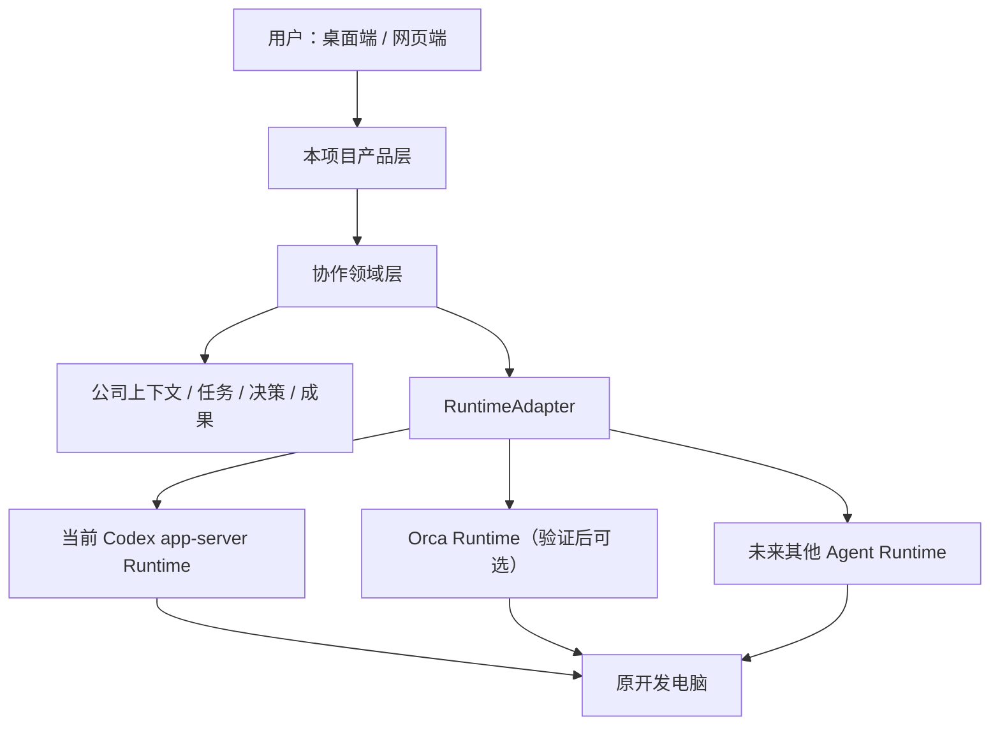

# Orca 开源复用与项目重构路径调研

调研日期：2026-07-29

调研对象：Stably AI Orca（`stablyai/orca`）

核对版本：稳定版标签 `v1.4.161`，提交 `df84fe6bc972a389ccb235dbe7450cf958107bb2`

用途：判断本项目是否应直接建立在 Orca 之上，以及哪些源码能够合法、现实地复用

状态：源码调研已完成；采用方式尚未由用户最终确认，不代表已经开始正式迁移

> 2026-07-29 状态更正：当天完成的 `codex/orca-runtime-adapter` 只验证了可选执行器和 Terminal 管理，没有迁移本文列出的任务编排、状态恢复、设备连接、UI 或 UAC 相关能力。该分支只算 Runtime Spike，不能算路线 2 已实现；正式路线 2 进度仍为 `0`。

## 一、执行结论

### 1. 可以直接使用别人的开源成果，再在上面增加我们的功能

法律上可行。Orca 使用 MIT License，允许复制、修改、商用和闭源分发。复制源码时需要保留原版权与许可证声明，不应直接使用 Orca 的名称、Logo 和宣传素材作为本项目品牌。

技术上也可行，但“直接使用”有四种完全不同的方式：

1. 整体 Fork Orca，再修改 UI 和功能。
2. 维护一个深度修改的 Orca 下游版本。
3. 把 Orca 当作独立执行底座，本项目通过适配层调用它。
4. 只复制 Orca 中相对独立、已经验证过的模块。

推荐采用 **第 3 种和第 4 种的组合**：

- Orca 或当前 Codex app-server 负责运行 Agent、维持会话、远程连接和底层可靠性。
- 本项目继续负责公司式多角色协作、共享上下文、任务分派、成果汇总、用户交互和跨模型接入。
- 通过统一的 `RuntimeAdapter` 隔离二者，避免产品完全依赖某一个外部项目。

### 2. 不建议现在放弃现有项目并整体 Fork Orca

Orca 已经是一个完整 Electron IDE，包含桌面 UI、网页、移动端、终端、PTY、SSH、Git、Agent、远程连接和多 Agent 编排。整体 Fork 会让本项目立即继承数千个文件、原生依赖、构建链和上游合并成本。

这条路线看似最快，实际很容易变成：长期跟着 Orca 修兼容性，同时我们自己的产品逻辑被埋在 Orca 内部。

### 3. Orca 的出现不是“天塌了”，但迫使项目重新定义价值

Orca 证明以下能力不再适合作为本项目的核心壁垒：

- 在网页或手机上远程连接本地 Agent。
- 保持终端和 Agent 会话。
- 同时运行多个 Agent。
- 为不同 CLI Agent 提供统一启动入口。

如果本项目最终只是“Codex 网页版 + 多 Agent 面板”，与 Orca 的重叠会非常高。

本项目仍然有价值的方向应收缩为：

1. 面向普通用户的“AI 小公司”协作体验，而不是 IDE 功能集合。
2. 多角色之间可解释的任务交接、提问、决策和成果审阅。
3. 公司长期上下文、项目事实、决策记录和结构化成果，而不是最近聊天记录拼接。
4. Codex、Claude、Gemini 及其他模型可替换、可组合的 Provider 层。
5. 桌面和网页之间连续、透明、无需用户理解底层进程的使用体验。

Orca 可以缩短底层建设时间，但不能替本项目完成上述产品定义。

## 二、Orca 已经覆盖了什么

| 编号 | Orca 已有能力 | 对本项目的意义 | 是否仍需自己开发 |
| --- | --- | --- | --- |
| 1 | Electron 桌面端和网页端复用同一套 React App | 证明桌面/Web 共用业务界面可行 | 需要保留我们自己的 UI，不必复制 Orca UI |
| 2 | `orca serve` Headless Runtime | 桌面窗口不启动也能提供网页、配对和运行时 | 可验证能否作为本项目执行底座 |
| 3 | WebSocket、心跳、重连、订阅恢复 | 解决远程连接不稳定和页面休眠恢复 | 当前 SSE 已覆盖一部分，只补缺口 |
| 4 | 设备配对、独立 Token、E2EE | 比当前共享 Token 更适合多设备 | 可改造移植 |
| 5 | Agent 启动、恢复和权限参数目录 | 为接入不同外部模型提供统一边界 | 应抽象成我们自己的 Provider Adapter |
| 6 | Run、Task、Dispatch、Delivery、Question、Outcome | 可替换当前临时群聊循环 | 借数据模型，产品流程仍需自己定义 |
| 7 | Daemon、PTY、终端恢复 | UI 退出后运行任务可以继续 | 不建议整套移植，可使用 Orca 或写极简 Connector |
| 8 | Worktree、SSH、远程文件和 Git 管理 | 支持多个开发 Agent 隔离工作 | 等并行修改规则确定后再采用 |
| 9 | Cloud Relay 客户端 | 可连接 Orca 官方远程服务 | 云端服务端未在仓库中公开，不能直接自建完整方案 |

## 三、四种采用方式对比

| 编号 | 方式 | 初始速度 | 长期成本 | 产品控制力 | 结论 |
| --- | --- | --- | --- | --- | --- |
| 1 | 整体 Fork Orca 并改界面 | 表面最快 | 很高，需要持续合并上游和维护原生模块 | 低，容易受 Orca 架构限制 | 不建议 |
| 2 | 深度修改 Orca，发行自己的桌面客户端 | 中等 | 高，差异越大越难升级 | 中等 | 只有决定转型为完整 IDE 时才考虑 |
| 3 | Orca 作为独立 Runtime，本项目做上层产品 | 快，但需要验证 RPC 稳定性 | 中等，可固定版本并通过适配层升级 | 高 | 建议先做可行性验证 |
| 4 | 选择性复制独立模块 | 初期稍慢 | 可控，代码完全由本项目维护 | 最高 | 建议用于可靠性和数据模型 |

最终推荐：**3 + 4 的混合路线**。

## 四、推荐目标架构

这个结构的关键不是同时维护三套后端，而是保证：

1. 用户界面不直接依赖 Orca 内部 RPC。
2. 群聊和共享上下文不存放在某一个 Agent 的私有 Thread 中。
3. Orca 以后变化、不可用或不再适合时，可以替换 Runtime，而不用重写整个产品。
4. 当前已经可用的 Codex app-server 路径继续保留，迁移可以逐步进行。

## 五、可以实际复用的源码

| 编号 | Orca 源码或设计 | 当前项目对应位置 | 处理方式 | 优先级 |
| --- | --- | --- | --- | --- |
| 1 | `src/shared/protocol-compat.ts` | `windows/server/web-version.mjs`、前端版本检查 | 复制纯逻辑和测试，增加最低兼容版本判断 | P0 |
| 2 | `src/shared/ws-outbound-backpressure-queue.ts` | `windows/server/realtime-hub.mjs` | 将 WebSocket 背压模型适配成 SSE `write/drain` | P0 |
| 3 | `runtime-subscription-replay.ts`、`rpc-delivery-ambiguity.ts` | 前端事件订阅和发送/停止操作 | 借用重放和“结果不确定”状态模型 | P0 |
| 4 | `src/shared/agent-status-types.ts` | `execution-tracker.mjs`、`multi-agent/protocol-state.mjs` | 统一单人和群聊的领域状态 | P0 |
| 5 | `tui-agent-config.ts`、Agent 启动/恢复纯函数 | `app-server-client.mjs`、`multi-agent-service.mjs` | 建立 `AgentProviderAdapter`，先实现 Codex | P1 |
| 6 | `orchestration/types.ts` | `multi-agent-service.mjs`、`group-room-store.mjs` | 引入 Run、Task、Dispatch、Delivery、Question、Outcome | P1 |
| 7 | Mutation Receipt 和请求幂等设计 | 所有启动、停止、追加输入操作 | 防止断线后重复执行有副作用的操作 | P1 |
| 8 | `device-registry.ts` | `http/access-control.mjs` | 共享 Token 改为每设备独立、可撤销身份 | P1 |
| 9 | `web-pairing.ts`、`web-e2ee.ts`、`e2ee-channel.ts` | Web API 和新的设备配对界面 | 客户端与服务端成套改造，采用自己的 v2-only 协议 | P2 |
| 10 | `static-web-client-handler.ts` | `windows/server/static-files.mjs` | 补目录穿越防护、白名单和缓存策略 | P1 |
| 11 | Worktree 路径及删除安全模块 | 未来多 Agent 并行开发 | 只搬安全校验，不搬整套 Git 管理层 | P2 |
| 12 | UI / Runtime / Daemon 三层分离 | `start-web-demo.ps1`、`app-server-client.mjs` | 借设计实现极简 Connector 和外部 Supervisor | P1 |

## 六、不应直接搬入的部分

1. 完整 Electron Renderer 和 `web-preload-api.ts`。后者约四千行，绑定 Orca 全部业务接口。
2. 完整 Daemon、PTY、xterm 和终端 checkpoint 系统。依赖范围过大。
3. 完整 Expo 移动应用。本项目当前 PWA 已能覆盖基础远程入口。
4. Orca Cloud Relay 客户端。没有公开的 Director/Cell 服务端，复制客户端不能得到可用云服务。
5. 完整 SQLite Coordinator。它绑定 Orca 的终端、Worktree、Federation 和 Runtime RPC。
6. 默认危险权限配置，包括 Codex 的 `--dangerously-bypass-approvals-and-sandbox` 和 Claude 的 `--dangerously-skip-permissions`。
7. Windows 防火墙自动修复逻辑。源码仍通过 `Start-Process -Verb RunAs` 触发 UAC，与“日常不让用户处理 UAC”的目标不一致。

## 七、直接把 Orca 当底座是否真的可行

目前判断是：**值得验证，但还不能直接宣布迁移。**

主要原因不是许可证，而是 Orca 没有提供稳定、正式承诺兼容的 npm SDK。它的 Runtime RPC 属于应用内部接口，未来版本可能变化。

最小验证不需要重写项目，只需要制作一个临时 `OrcaRuntimeAdapter`，固定使用稳定版 `v1.4.161`，验证以下流程：

1. 从本项目启动或连接 `orca serve`。
2. 新建一个 Codex Agent 会话。
3. 接收实时进度、文本、工具调用和等待状态。
4. 停止、继续和恢复已有会话。
5. 关闭并重新打开网页后，恢复同一个任务和历史事件。
6. 桌面 UI 退出后，网页和运行任务是否仍然存活。
7. Orca Runtime 退出后，能否由外部 Supervisor 拉起并恢复可解释状态。
8. 不依赖 Orca 官方 Cloud Relay 时，能否继续使用当前 Cloudflare 出站 Tunnel。

### 验证通过标准

满足以下条件，才建议把 Orca 作为正式底座：

1. 不需要修改 Orca 大量内部代码即可完成新建、执行、恢复和事件订阅。
2. 本项目 UI 不需要直接导入 Orca Renderer 或 Electron 代码。
3. Orca 升级时，变化能够限制在 `OrcaRuntimeAdapter` 内。
4. 所有任务状态可以同步进本项目自己的任务账本。
5. 不依赖未开源的 Orca Cloud Relay。
6. 不需要默认开启跳过审批和沙箱的危险权限。

### 验证失败后的退路

即使验证失败，调研也不会浪费：继续保留当前 Codex app-server Runtime，并按第五部分选择性移植 Orca 的纯模块和数据模型。

## 八、主要风险

| 编号 | 风险 | 实际后果 | 控制方式 |
| --- | --- | --- | --- |
| 1 | Orca 内部 RPC 变化 | 升级后适配器失效 | 固定版本、契约测试、所有调用集中在适配器 |
| 2 | 深度 Fork 后无法跟进上游 | 安全修复和新功能难合并 | 不在 Orca UI 内堆叠产品逻辑 |
| 3 | Cloud Relay 服务端未开源 | 无法完整自建 Orca Anywhere | 保留当前出站 Tunnel，必要时自建独立 Relay |
| 4 | 默认权限过宽 | Agent 误操作文件或系统 | 自己定义权限策略，不复制默认 YOLO 参数 |
| 5 | 两套任务状态不一致 | UI 显示完成但 Runtime 仍运行 | 本项目任务账本作为产品层权威状态，Runtime 状态定期对账 |
| 6 | 产品继续与 Orca 同质化 | 即使技术完成也缺乏市场价值 | 把资源集中到公司式协作、上下文和跨模型体验 |
| 7 | 复制代码的许可证遗漏 | 分发和融资尽调风险 | 建立 `THIRD_PARTY_NOTICES`，复制文件保留来源和 MIT 声明 |

## 九、建议的实际决策

### 当前不做

1. 不删除或废弃现有项目。
2. 不立即整体 Fork Orca。
3. 不继续自行重做 PTY、完整远程 Relay 和完整 IDE。
4. 不继续给当前 `currentRun + workQueue` 群聊循环无限打补丁。

### 当前应该做

1. 用一个短周期技术验证判断 Orca Runtime 能否作为可替换底座。
2. 同时把本项目的产品层、协作领域层和 Runtime 调用层拆开。
3. 无论验证结果如何，都引入统一 Agent Provider、任务账本和可靠性小模块。
4. 把本项目的差异化明确为“AI 小公司协作层”，而不是另一个 Agent IDE。

### 最终判断

“直接用别人的东西，再在此基础上增加我们的东西”是正确方向，但需要精确表达为：

> 优先选择性迁移 Orca 已经完成且可独立维护的可靠性、状态和编排模块；是否同时使用 Orca Runtime，必须作为独立技术选择由用户确认。

这条路线可以减少重复开发，同时避免把产品未来完全交给 Orca 的产品方向。单独完成 Runtime Adapter 不等于完成源码迁移，也不会自然改善现有群聊、上下文、存储和 UI。

## 十、官方源码依据

1. 仓库与 README：`https://github.com/stablyai/orca`
2. MIT License：`https://github.com/stablyai/orca/blob/main/LICENSE`
3. 本次核对提交：`https://github.com/stablyai/orca/commit/df84fe6bc972a389ccb235dbe7450cf958107bb2`
4. 本次核对稳定版：`https://github.com/stablyai/orca/releases/tag/v1.4.161`
5. Headless Serve：`src/cli/specs/serve.ts`
6. 编排说明：`skill-guides/orchestration.md`
7. Agent 权限参数：`src/shared/tui-agent-permissions.ts`
8. Windows 防火墙/UAC：`src/main/runtime/windows-mobile-firewall.ts`
9. Relay 客户端：`src/main/runtime/relay/relay-http-client.ts`

## 十一、仍待验证的内容

1. Orca Runtime RPC 在稳定版之间的实际兼容程度。
2. `orca serve` 是否能在不加载完整桌面依赖的情况下长期稳定运行于当前 Windows 环境。
3. 当前 Codex app-server Thread 与 Orca Agent Session 的身份映射方式。
4. Orca 更新时正在执行的 Agent 和本项目任务账本如何对账。
5. 是否需要维护一个极小的 Orca 补丁集，还是完全使用未修改的上游二进制。
